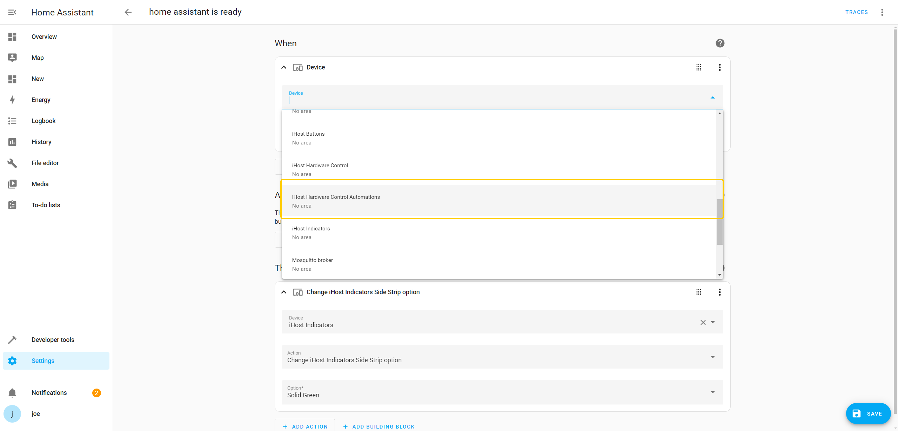
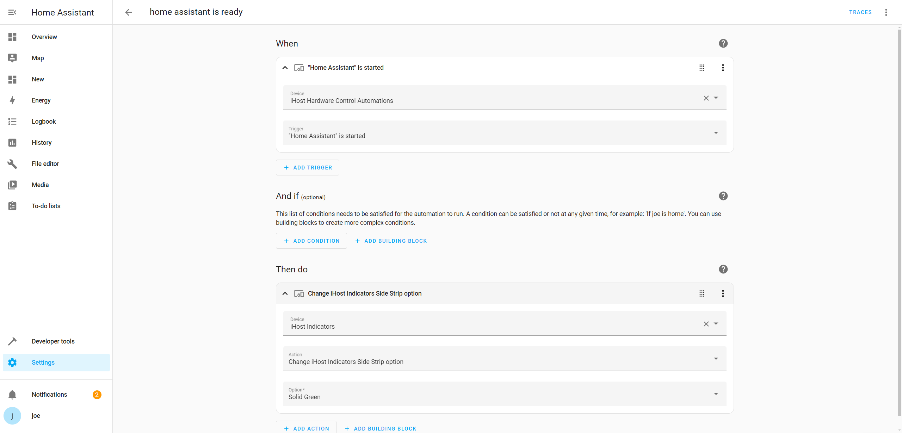
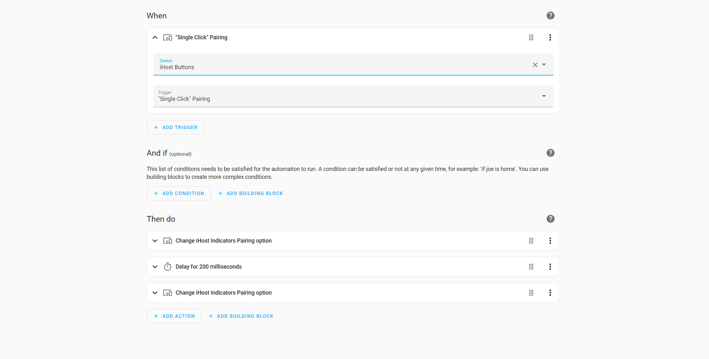
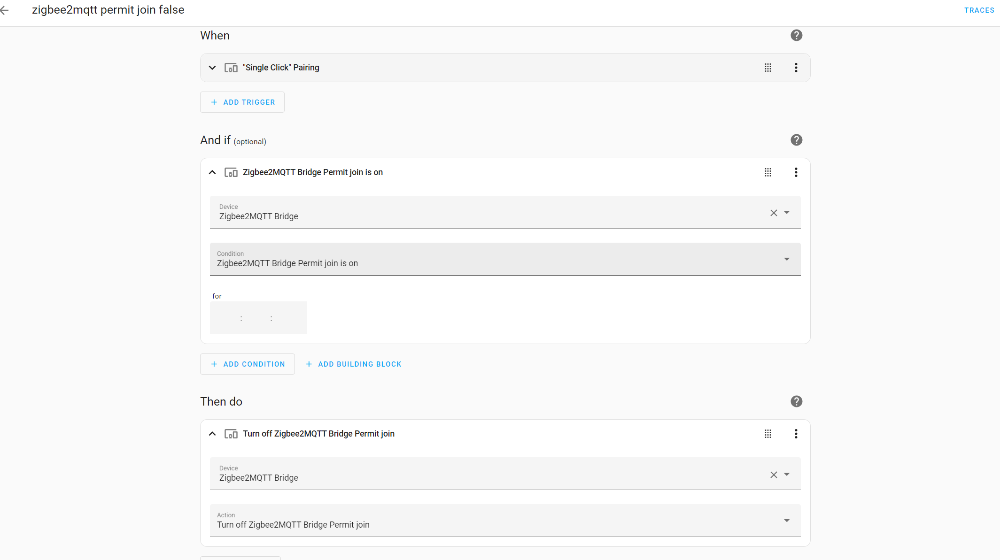
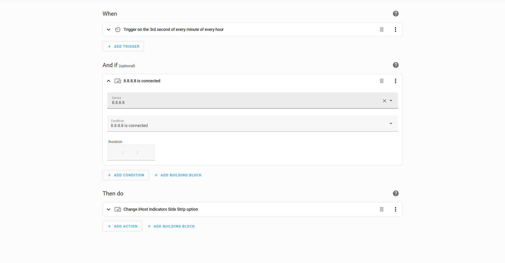
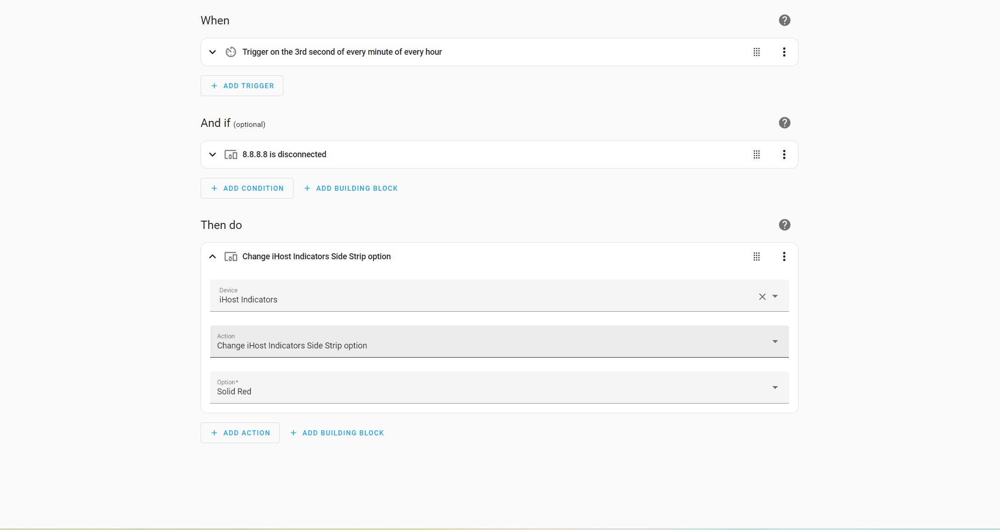
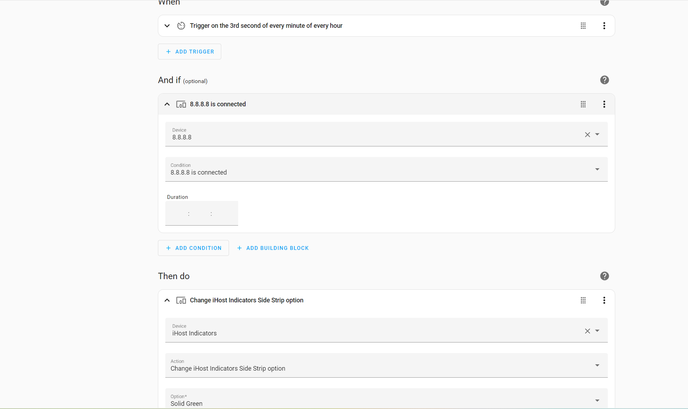
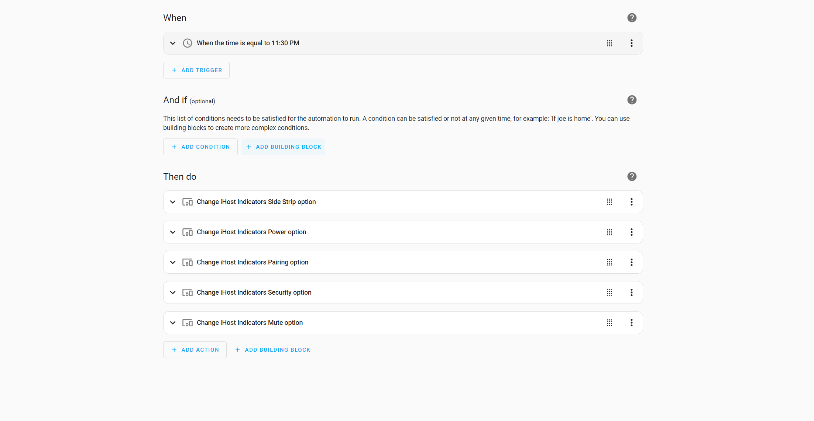

# iHost Hardware Control Add-on Wiki

## Add-on概述

**iHost Hardware Control Addon** 是我们为 iHost 网关专属开发的硬件控制插件。该插件通过 MQTT 协议与 Home Assistant 进行通信，将 iHost 的实体按键、状态指示灯、RGB 灯带等硬件能力完整映射到 Home Assistant 中。

用户可以通过 Home Assistant 的自动化功能，自由配置和联动这些硬件资源，构建更贴合个人习惯和家庭场景的智能交互体验。

## 插件提供的实体能力

### iHost 按键

在 iHost 机身上方有4个物理按键，分别为电源按键、配对按键、静音按键、安防按键，机身侧边有一个小孔内重置按键，这5个按键都会作为一个名为“iHost 按键”的设备存在，其带有5个<event>实体，具体信息参考下方表格

- 注意：iHost 电源按键长按10s 将会从硬件上关机

| 设备       | 实体     | 能力                          |
| ---------- | -------- | ----------------------------- |
| iHost 按键 | 电源按键 | 单击                          |
| iHost 按键 | 配对按键 | 单击                          |
| iHost 按键 | 静音按键 | 单击                          |
| iHost 按键 | 安防按键 | 单击                          |
| iHost 按键 | 重置按键 | 双击、长按（按住按键超过10s） |

### 指示灯设备实体

iHost 机身上方的 4 个按键都分别有一个蓝色指示灯，机身侧边有一个长灯条，这5个指示灯都会作为一个名为“iHost 指示灯”的设备存在，其带有5个 **Select** entity ，具体信息参考下方表格

| 设备         | 实体           | 能力                                                         |
| ------------ | -------------- | ------------------------------------------------------------ |
| iHost 指示灯 | 电源按键指示灯 | 关闭（Off）打开（蓝色常亮）（On）快闪（Rapid Flashing）周期性双闪  （Double Flashing ） |
| iHost 指示灯 | 配对按键指示灯 | 关闭（Off）打开（蓝色常亮）（On）快闪（Rapid Flashing）周期性双闪  （Double Flashing ） |
| iHost 指示灯 | 静音按键指示灯 | 关闭（Off）打开（蓝色常亮）（On）快闪（Rapid Flashing）周期性双闪  （Double Flashing ） |
| iHost 指示灯 | 安防按键指示灯 | 关闭（Off）打开（蓝色常亮）（On）快闪（Rapid Flashing）周期性双闪  （Double Flashing ） |
| iHost 指示灯 | 侧边指示灯条   | 关闭 （Off） 打开（显示上次关闭时的灯效）（On）  蓝色常亮 （Solid Blue ） 红色常亮（Solid Red ）  绿色常亮（Solid Green）  黄色常亮（Solid Yellow） 橙色常亮（Solid Orange） 紫色常亮（Solid Purple ） 红色快闪（Rapid Flashing Red） 蓝色快闪（Rapid Flashing Blue ） 黄色快闪（Rapid Flashing Yellow ） 红色周期性双闪（  Double Flashing Red  ）  蓝色周期性双闪（ Double Flashing Blue   ）  绿色周期性双闪（ Double Flashing Green  ）  红色单次双闪（ Double Flashing Red then Revert  ） 蓝色单次双闪（ Double Flashing Blue then Revert  ） 绿色单次双闪（ Double Flashing Green then Revert  ）   红色呼吸（ Breathing Red  ） 蓝色呼吸（ Breathing Blue） 黄色呼吸（ Breathing Yellow） 绿色呼吸（Breathing Green ） 橙色呼吸（ Breathing Orange） 紫色呼吸 （Breathing Purple ） 红色跑马灯（Red Marquee Light） |

这些实体会在 Home Assistant 中以标准方式展示，用户可用于创建自动化规则或脚本。

## 推荐的 Automation 设置

我们为用户设计了以下推荐的自动化设置，帮助你快速体验插件的核心价值。以下内容均可通过 Home Assistant 的“自动化”功能轻松实现：

### 1. 设置开机提示灯效

**场景描述**：希望 Home Assistant 启动完成后，有明显的灯光提示。

**实现方式**：

1. Create new automation.

2. When -> Add Trigger -> Device -> iHost Hardware Automations ->“Home Assistant”is started.

3. Action -> Add action -> Device -> iHost Indicators -> Change iHost Indicators Side Strip option -> Solid Green.

此场景适用于判断系统是否准备就绪。

### 2. 关机后自动关闭灯效

**场景描述**：在 iHost 关机时自动熄灭所有灯效，节省能耗、避免误导。

**实现方式**：

无需用户配置，系统关闭时addon会自动关闭所有灯效，无需手动干预。

### 3. 按键反馈灯效

**场景描述**：在 iHost 单击配对按键时，按键指示灯有反馈灯效，打开指示灯，200ms后再关闭指示灯。

**实现方式**：

1. Create new automation.
2. When -> Add Trigger -> Device -> iHost Buttons -> "Single Click" Pairing

3. Action -> Add action -> Device -> iHost Indicators -> Change iHost Indicators Pairing option -> on

4. Action -> Add action -> Delay for 200 milliseconds
5. Action -> Add action -> Device -> iHost Indicators -> Change iHost Indicators Pairing option -> off

### 4. 利用配对键控制 Zigbee2MQTT 入网灯效

**场景描述(4个自动化)**：

1. 按下配对键，显示按键灯效 (打开指示灯，200ms后再关闭指示灯)，并允许 ZigBee 子设备加入网络。

2. 配网过程中，按下配对键，显示按键灯效 (打开指示灯，200ms后再关闭指示灯)，停止ZigBee入网。

3. 配网中，灯带显示灯效（橙色呼吸）。

4. 配网停止，灯带显示灯效（绿色常量）。

**【自动化一】未配对状态，配对按键触发允许入网**：

1. Create new automation.
2. When -> Add Trigger -> Device -> iHost Buttons -> "Single Click" Pairing
3. And if -> Add condition -> Device -> Zigbee2MQTT Bridge -> Zigbee2MQTT Bridge Permit join is off
4. Action -> Add action -> Device -> Zigbee2MQTT Bridge -> Turn on Zigbee2MQTT Bridge Permit join.

**【自动化二】配对中，配对按键触发停止入网**：

1. Create new automation.
2. When -> Add Trigger -> Device -> iHost Buttons -> "Single Click" Pairing
3. And if -> Add condition -> Device -> Zigbee2MQTT Bridge -> Zigbee2MQTT Bridge Permit join is on
4. Action -> Add action -> Device -> Zigbee2MQTT Bridge -> Turn off Zigbee2MQTT Bridge Permit join.

**【自动化三】检测到配对中**

1. Create new automation.
2. When -> Add Trigger -> Device -> Zigbee2MQTT Bridge -> Zigbee2MQTT Bridge Permit join turned on
3. Action -> Add action -> Device -> iHost Indicators -> Change iHost Indicators Side Strip option -> Breathing Orange

**【自动化四】检测到退出配对**

1. Create new automation.
2. When -> Add Trigger -> Device -> Zigbee2MQTT Bridge -> Zigbee2MQTT Bridge Permit join turned off
3. Action -> Add action -> Device -> iHost Indicators -> Change iHost Indicators Side Strip option -> Solid Green.

### 5. 网络离线告警灯效

**场景描述**：当设备无法访问互联网时，灯带呈现红色警示。需要安装Ping（ICMP）集成，ping地址为8.8.8.8。

**实现方式**：

1. Create new automation.
2. When -> Add Trigger -> Trigger on the 3rd second of every minute of every hour

3. And if -> Add condition -> Device -> 8.8.8.8(ping集成提供的设备) -> 8.8.8.8 is disconnected

4. Action -> Add action -> Device -> iHost Indicators -> Change iHost Indicators Side Strip option -> Solid Red

### 6. 网络恢复灯效提示

**场景描述**：当网络恢复时，灯带自动恢复绿色常亮，提示系统恢复正常。需要安装Ping（ICMP）集成，ping地址为8.8.8.8。

**实现方式**：

1. Create new automation.
2. When -> Add Trigger -> Trigger on the 3rd second of every minute of every hour
3. And if -> Add condition -> Device -> 8.8.8.8(ping集成提供的设备) -> 8.8.8.8 is connected

1. Action -> Add action -> Device -> iHost Indicators -> Change iHost Indicators Side Strip option -> Solid Green.

### 7. 夜间关闭所有灯效

**场景描述**：夜间自动关闭所有指示灯和灯带，避免光污染或影响休息。

**实现方式**：

1. Create new automation.
2. When -> Add Trigger -> When the time is equal to 11:30 PM
3. Action -> Add action -> Device -> iHost Indicators -> Change iHost Indicators Side Strip option -> off.
4. Action -> Add action -> Device -> iHost Indicators -> Change iHost Indicators Power option -> off
5. Action -> Add action -> Device -> iHost Indicators -> Change iHost Indicators Pairing option -> off
6. Action -> Add action -> Device -> iHost Indicators -> Change iHost Indicators Security option -> off
7. Action -> Add action -> Device -> iHost Indicators -> Change iHost Indicators Mute option -> off

------

### 8. 使用电源键物理关机

**场景描述**：无需使用 Web 界面，直接通过机身物理按键实现关机操作。

**实现方式**：

- 长按电源按键约 10 秒钟，系统将执行关机操作。
- 若需再次开机，只需轻按电源键一次。

此功能无需配置，已由插件自动处理。适合断电保护场景或维护需求。
