[中文文档](wiki_zh.md)
# iHost Hardware Control Add-on Wiki

## Add-on Overview

The **iHost Hardware Control Addon** is a hardware control add-on exclusively developed for the iHost gateway. This add-on communicates with Home Assistant via the MQTT protocol, fully mapping iHost's hardware capabilities, such as physical buttons, status indicators, and RGB light strips, to Home Assistant.
Users can freely configure and link these hardware resources using Home Assistant's automation features, creating a more personalized and intelligent interaction experience based on their habits and home scenarios.

## Entities Provided by the add-on

### iHost Buttons 

The iHost device has 4 physical buttons on the top: Power Button, Pairing Button, Mute Button, and Security Button, as well as a small hole on the side for a Reset Button. These 5 buttons are represented as a device called **"iHost Buttons"** and have 5 associated <event> entities. Please refer to the table below for specific details.

- **Note**: *A long press (10 seconds) on the Power Button will turn off the iHost hardware.*

| Device        | Entities | Capabilities                                                 |
| ------------- | -------- | ------------------------------------------------------------ |
| iHost Buttons | Power    | Single Click                                                 |
| iHost Buttons | Pairing  | Single Click                                                 |
| iHost Buttons | Mute     | Single Click                                                 |
| iHost Buttons | Security | Single Click                                                 |
| iHost Buttons | Reset    | Double Click Long Press  (Hold the button for more than 10s) |

### iHost Indicator 

Each of the 4 physical buttons on the iHost has a blue indicator light, and there is also a long light strip on the side. These 5 indicator lights are represented as a device called **"iHost Indicators"**, each having a **Select** entity. Please refer to the table below for specific details.

| Device           | Entities   | Capabilities                                                 |
| ---------------- | ---------- | ------------------------------------------------------------ |
| iHost Indicators | Power      | On ,Off ,Rapid Flashing、Double Flashing                     |
| iHost Indicators | Pairing    | On ,Off ,Rapid Flashing、Double Flashing                     |
| iHost Indicators | Mute       | On ,Off ,Rapid Flashing、Double Flashing                     |
| iHost Indicators | Security   | On ,Off ,Rapid Flashing、Double Flashing                     |
| iHost Indicators | Side Strip | 1. Off  2. On  3. Solid Blue  4. Solid Red  5. Solid Green 6. Solid Yellow  7. Solid Orange  8. Solid Purple  9. Rapid Flashing Red  10. Rapid Flashing Blue  11. Rapid Flashing Yellow  12. Double Flashing Red  13. Double Flashing Blue  14. Double Flashing Green  15. Double Flashing Red then Revert  16. Double Flashing Blue then Revert  17. Double Flashing Green then Revert  18. Breathing Red  19. Breathing Blue  20. Breathing Yellow  21. Breathing Green  22. Breathing Orange  23. Breathing Purple  24. Marquee Red |

These entities will be displayed in Home Assistant in the standard way and can be used to create automation rules or scripts.

## Recommended Automation Settings

We have designed the following recommended automation settings to help you quickly experience the core value of the add-on. All of the following can be easily implemented using Home Assistant's "Automation" feature:

### Setting Startup Light Effect

#### Scenario Description:

You want a noticeable light effect when Home Assistant finishes starting up.

#### Implementation：

1. Create new automation.
2. When -> Add Trigger -> Device -> iHost Hardware Automations -> "Home Assistant" is started.

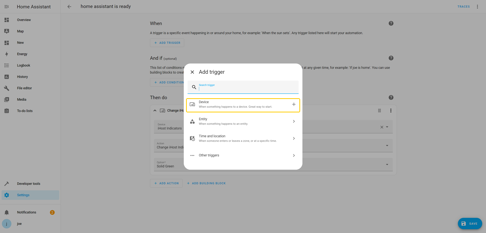

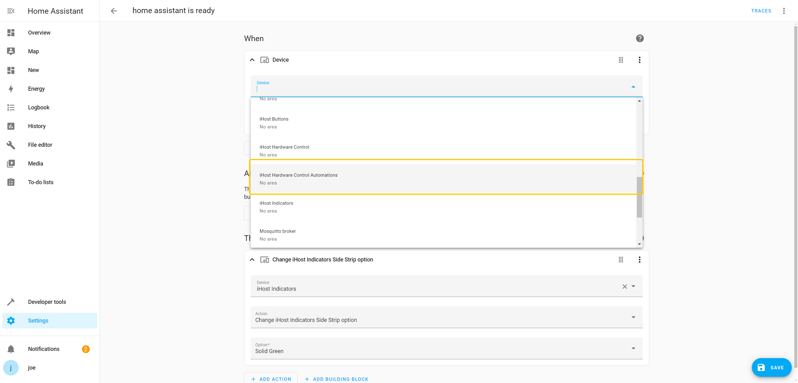

3. Action -> Add action -> Device -> iHost Indicators -> Change iHost Indicators Side Strip option -> Solid Green. This scenario helps indicate whether the system is ready.

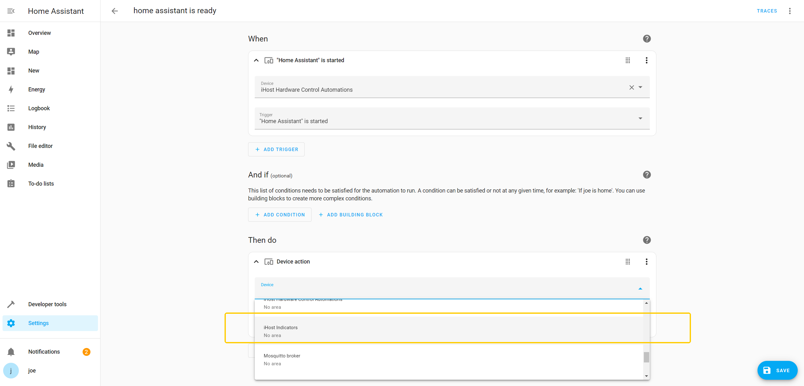

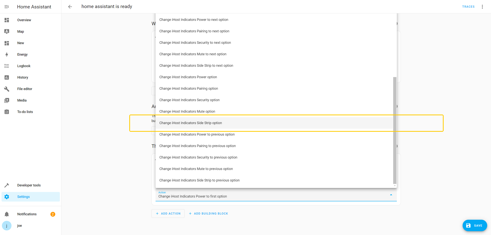

### Automatically Turn Off Lights After Shutdown

#### Scenario Description: 

Automatically turn off all lights when iHost shuts down to save energy and avoid confusion.

#### Implementation: 

No user configuration is required. The addon will automatically turn off all lights when the system shuts down, with no manual intervention needed.

### Button Feedback Light Effect

#### Scenario Description: 

When you press the Pairing Button on iHost, the button indicator has a feedback light effect: turn on the indicator, then turn it off after 200ms.

#### Implementation:

1. Create new automation.
2. When -> Add Trigger -> Device -> iHost Buttons -> "Single Click" Pairing.

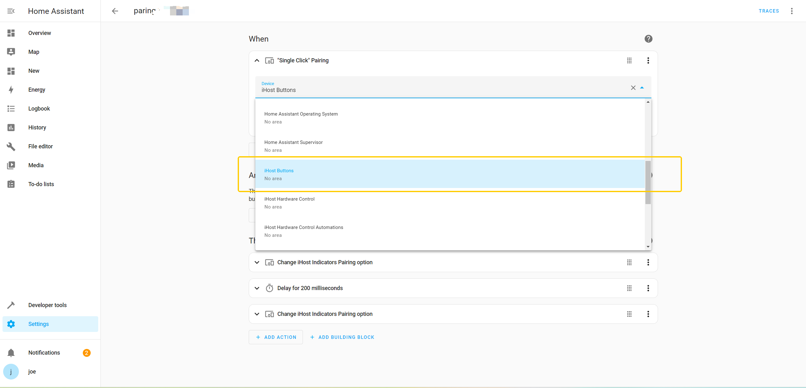

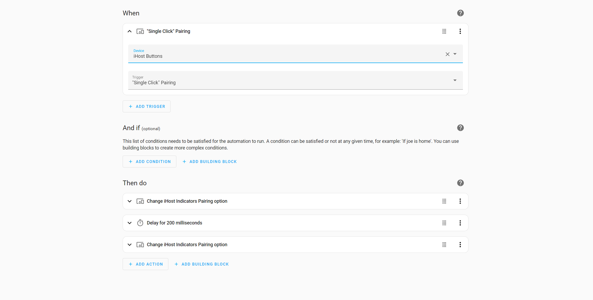

3. Action -> Add action -> Device -> iHost Indicators -> Change iHost Indicators Pairing option -> On.

4. Action -> Add action -> Delay for 200 milliseconds.

5. Action -> Add action -> Device -> iHost Indicators -> Change iHost Indicators Pairing option -> Off.

### Using the Pairing Button to Control Zigbee2MQTT Network Join Light Effects

#### Scenario Description (4 automations):

1. Press the Pairing Button to show the button light effect (turn on the indicator, then turn it off after 200ms) and allow ZigBee devices to join the network.

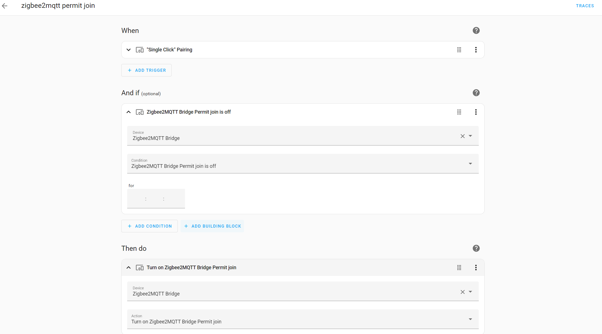

2. During the network joining process, press the Pairing Button to show the button light effect (turn on the indicator, then turn it off after 200ms) and stop ZigBee network joining.

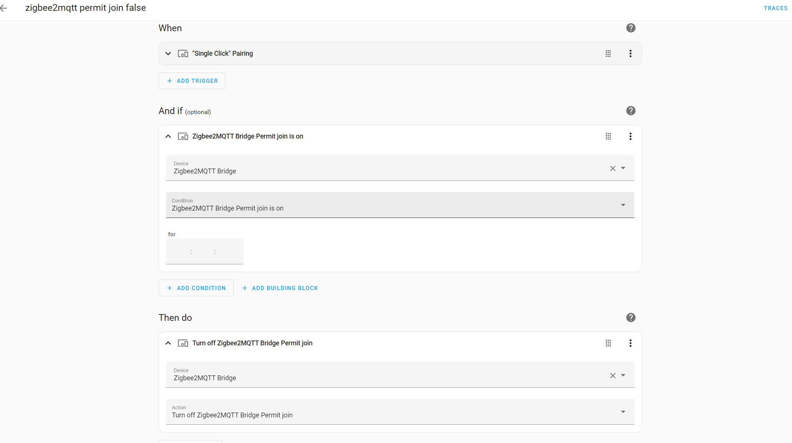

3. During the network joining process, the light strip shows an orange breathing light effect.

4. After network joining stops, the light strip shows a solid green light effect.

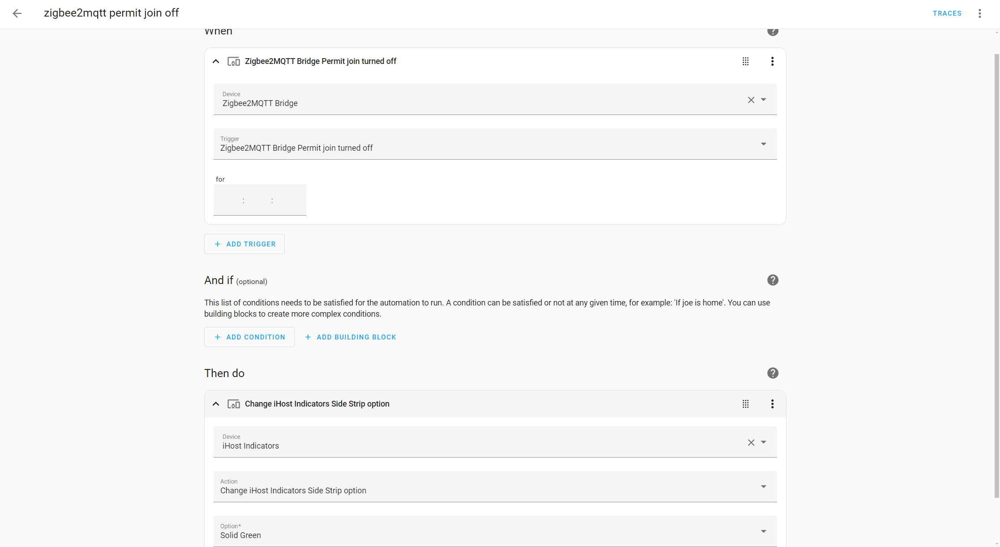

##### [Automation 1] No Pairing State, Pairing Button to Trigger Network Join:

1. Create new automation.
2. When -> Add Trigger -> Device -> iHost Buttons -> "Single Click" Pairing.
3. And if -> Add condition -> Device -> Zigbee2MQTT Bridge -> Zigbee2MQTT Bridge Permit join is off.
4. Action -> Add action -> Device -> Zigbee2MQTT Bridge -> Turn on Zigbee2MQTT Bridge Permit join.

##### [Automation 2]  During Pairing, Pairing Button to Stop Network Join:

1. Create new automation.
2. When -> Add Trigger -> Device -> iHost Buttons -> "Single Click" Pairing.
3. And if -> Add condition -> Device -> Zigbee2MQTT Bridge -> Zigbee2MQTT Bridge Permit join is on.
4. Action -> Add action -> Device -> Zigbee2MQTT Bridge -> Turn off Zigbee2MQTT Bridge Permit join.

##### [Automation 3] Detecting Pairing Mode:

1. Create new automation.
2. When -> Add Trigger -> Device -> Zigbee2MQTT Bridge -> Zigbee2MQTT Bridge Permit join turned on.
3. Action -> Add action -> Device -> iHost Indicators -> Change iHost Indicators Side Strip option -> Breathing Orange.

##### [Automation 4] Detecting Pairing Exit:

1. Create new automation.
2. When -> Add Trigger -> Device -> Zigbee2MQTT Bridge -> Zigbee2MQTT Bridge Permit join turned off.
3. Action -> Add action -> Device -> iHost Indicators -> Change iHost Indicators Side Strip option -> Solid Green.

### Network Offline Alarm Light Effect

#### Scenario Description:

 When the device is unable to access the internet, the light strip displays a red warning. The Ping (ICMP) integration should be installed with the ping address set to 8.8.8.8. 

#### Implementation:

1. Create new automation.
2. When -> Add Trigger -> Trigger on the 3rd second of every minute of every hour.

3. And if -> Add condition -> Device -> 8.8.8.8 (Ping integration device) -> 8.8.8.8 is disconnected.

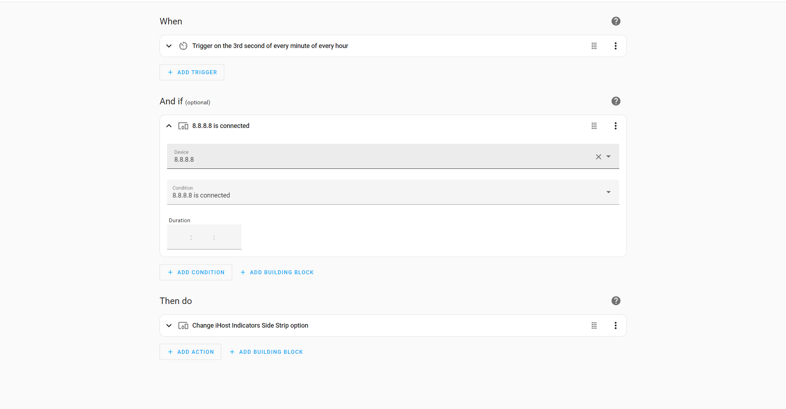
4. Action -> Add action -> Device -> iHost Indicators -> Change iHost Indicators Side Strip option -> Solid Red.

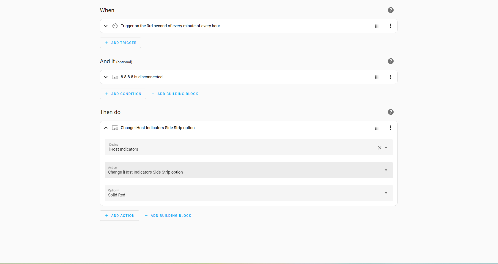

### Network Recovery Light Effect

#### Scenario Description:

 When the network recovers, the light strip automatically turns back to solid green, signaling that the system has returned to normal.

#### Implementation:

1. Create new automation.
2. When -> Add Trigger -> Trigger on the 3rd second of every minute of every hour.
3. And if -> Add condition -> Device -> 8.8.8.8 (Ping integration device) -> 8.8.8.8 is connected.

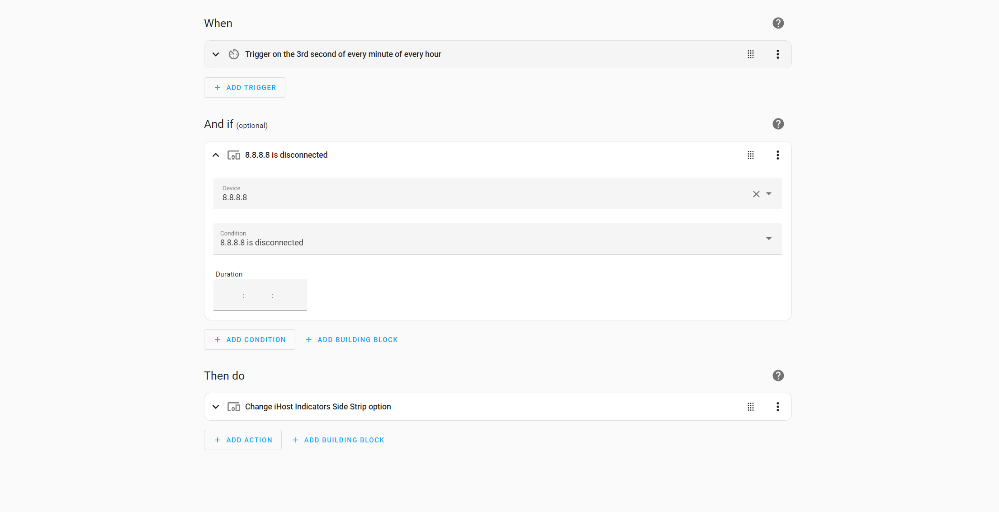

4. Action -> Add action -> Device -> iHost Indicators -> Change iHost Indicators Side Strip option -> Solid Green.

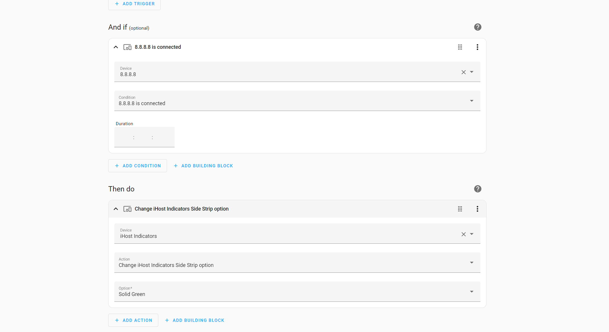

### Turn Off All Lights at Night

#### Scenario Description:

Automatically turn off all indicators and light strips at night to avoid light pollution or disruption during sleep. 

#### Implementation:

1. Create new automation.
2. When -> Add Trigger -> When the time is equal to 11:30 PM.
3. Action -> Add action -> Device -> iHost Indicators -> Change iHost Indicators Side Strip option -> Off.
4. Action -> Add action -> Device -> iHost Indicators -> Change iHost Indicators Power option -> Off.
5. Action -> Add action -> Device -> iHost Indicators -> Change iHost Indicators Pairing option -> Off.
6. Action -> Add action -> Device -> iHost Indicators -> Change iHost Indicators Security option -> Off.
7. Action -> Add action -> Device -> iHost Indicators -> Change iHost Indicators Mute option -> Off.

### Use the Power Button for Physical Shutdown

#### Scenario Description: 

Shutdown can be performed directly via the physical button on the iHost device, without using the web interface. 

#### Implementation:

1. Press and hold the Power Button for approximately 10 seconds to initiate shutdown.

2. To turn the system back on, simply press the Power Button once. This feature does not require configuration and is automatically handled by the add-on. 

   **Note:** *It is ideal for power-off protection or maintenance scenarios.*